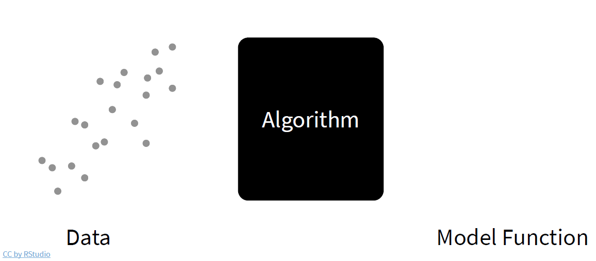
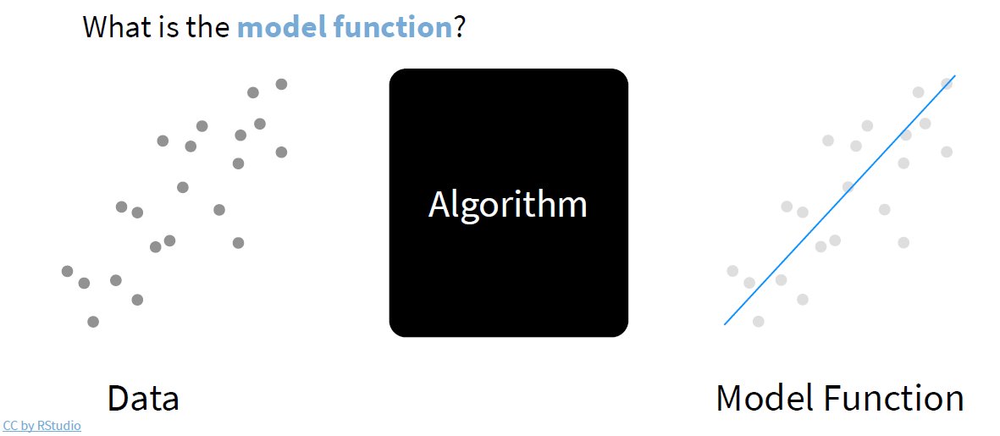
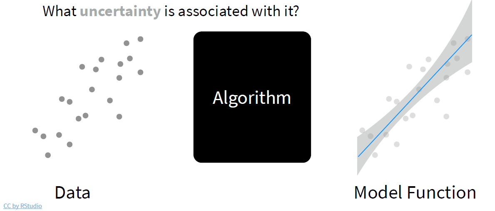
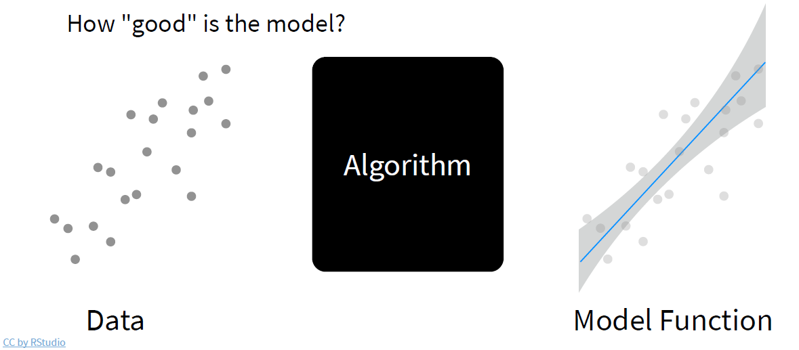
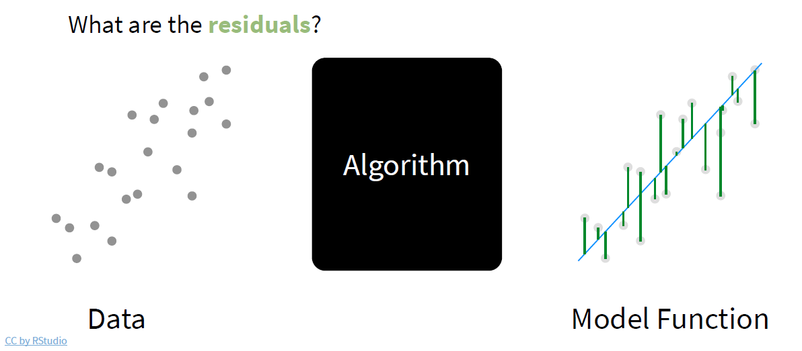
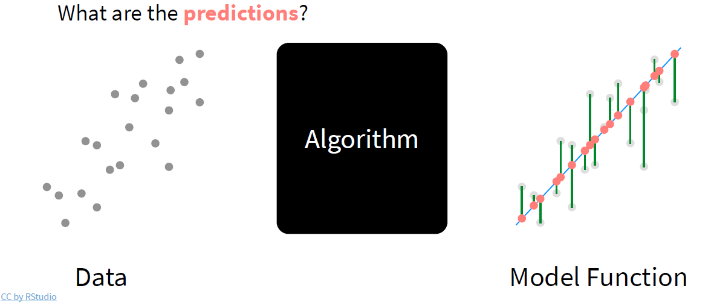
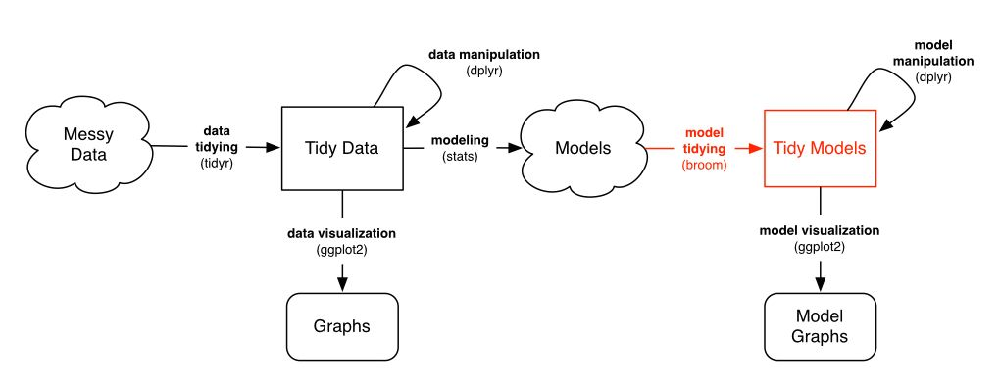
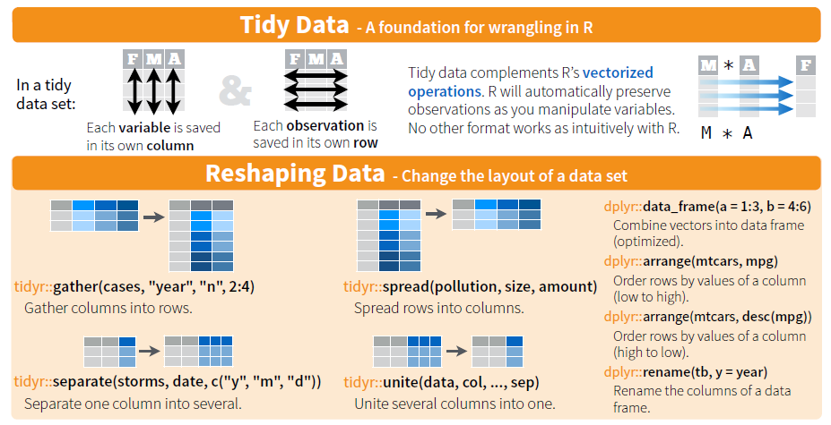

```{r xaringan-themer, include = FALSE}
library(xaringanthemer)
mono_accent(base_color = "#43418A")
```


# About the teacher

A collection of links: 

- [my personal website](https://katrienantonio.github.io)

- [my GitHub page](https://github.com/katrienantonio) 

- an [e-book](https://katrienantonio.github.io/intro-R-book/) with more documentation.

Research team is [here](https://katrienantonio.github.io/lab/lab-members/). 

---

# Practical information

Course material including

- R scripts, data, lecture sheets 

- a collection of **cheat sheets** 

are available from


<center>
<font size="5">
<a href="https://github.com/katrienantonio/PE-Programming-R-for-data-science"target="_blank">https://github.com/katrienantonio/PE-Programming-R-for-data-science</a>
</font>
</center>

<br>

---

class: center, middle

# Today's agenda

---

# Learning outcomes

Today you will work on:

- optimization 

- fitting distributions to data with MLE

- functional programming

- linear models

- generalized linear models *(see R markdown tutorial)*

- generalized additive models *(see R markdown tutorial)*

- decision trees *(see R markdown tutorial)*

You will cover examples of code<sup>1</sup> and work on **R challenges**.

.footnote[
[1] For a detailed discussion of each topic, see [e-book](https://katrienantonio.github.io/intro-R-book).
]

---

# Questions after day 1

How can I

* estimate a parametric distribution (e.g. normal, Poisson) to a given data set

* generate and store losses from the random variable $L_i = \sum_{j=1}^{N_i} Y_{ij}$ the aggregate loss of policyholder $i$ 

* create an R project. 

---

class: inverse, center, middle

# Fitting distributions to data

---

# Optimization

Actuaries often write functions (e.g. a likelihood) that have to be optimized. 

Therefore, you'll:

* get to know some R functionalities to do **optimization**

* apply this knowledge to **fit a distribution** to a give data set.


---

# Find the root of a function

Consider the function $f: x \mapsto x^2-3^{-x}$. 

What is the root $x$ of this function over the interval $[0,1]$, so that $f(x) = 0$?

```{r}
uniroot(function(x) x^2-3^(-x), lower = 0, upper = 1)
```

---

# Find the root of a function

First, define the function $f(.)$

```{r}
f <- function(x){
	x^2-3^(-x)
}
```

Then, calculate its root with `uniroot`:
```{r}
opt <- uniroot(f, lower = 0, upper = 1)
names(opt)
```

and evaluate $f(.)$ in the root 
```{r}
f(opt$root)
```

---

# Find the root of a function

To conclude, you build a visualization (with base R).

```{r out.width='45%', fig.align="center"}
range <- seq(-2, 2, by = 0.2)
plot(range, f(range), type = "l")
points(opt$root, f(opt$root), pch = 20)
segments(opt$root, -7, opt$root, 0, lty = 2)
segments(-3, 0, opt$root, 0, lty = 2)
```


---

# Find the root of a function

To conclude, you build a visualization (in `ggplot` style).

```{r out.width='40%', fig.align="center"}
data <- data.frame(x = range, y = f(range))
ggplot(data, aes(x = x, y = y)) + geom_line() + 
    geom_point(x = opt$root, y = f(opt$root)) +
    geom_segment(x = opt$root, y = -7, xend = opt$root, yend = 0, linetype = "dashed") +
    geom_segment(x = -3, y = 0, xend = opt$root, yend = 0, linetype = "dashed") +
    theme_bw()
```

---

# Find the maximum of a function

You look for the maximum of the beta density for a given set of parameters.

First, you sketch the beta density.

```{r out.width='40%', fig.align="center"}
shape_1 <- 3; shape_2 <- 2
x <- seq(from = 0, to = 1, by = 0.01)
curve(dbeta(x, shape_1, shape_2), xlim = range(x))
```

---

# Find the maximum of a function

Now, find the maximum of this beta density

```{r}
opt_beta <- optimize(dbeta, interval = c(0, 1), maximum = TRUE, shape_1, shape_2)
```

and visualize

```{r out.width='35%', fig.align="center"}
curve(dbeta(x, shape_1, shape_2), xlim = range(x))
points(opt_beta$maximum, opt_beta$objective, pch = 20, cex = 1.5)
segments(opt_beta$maximum, 0, opt_beta$maximum, opt_beta$objective, lty = 2)
```

---

# Do Maximum Likelihood Estimation (MLE)

You generate data from a gamma distribution with given parameters.

```{r}
nsim <- 10000
x <- rgamma(nsim, shape = 3, rate = 1.5)
```

First, you'll compare empirical mean and variance with the theoretical quantities

```{r}
mean(x) ; var(x)
```

versus 

```{r}
3 * (1/1.5) ;  3 * (1/1.5)^2
```

---

# Do Maximum Likelihood Estimation (MLE)

Picture the simulated data

```{r out.width='45%', fig.align="center"}
d <- data.frame(x)
ggplot(d, aes(x = x)) + geom_histogram(aes(y = ..density..), binwidth = 0.3, color = "black", fill = "white") +
  geom_density(alpha = .2, fill = "#FF6666") +
  theme_bw()
```


---

# Do Maximum Likelihood Estimation (MLE)

With Maximum Likelihood Estimation:

* $\boldsymbol{\theta} = (\theta_1, \ldots, \theta_k)^t$ is the parameter vector

* the likelihood function

\begin{eqnarray}
\mathcal{L}(\boldsymbol{\theta}; y_1, \ldots, y_n) = \prod_{i=1}^n f(y_i;\boldsymbol{\theta})
\end{eqnarray}

* the log-likelihood function

\begin{eqnarray}
L(\boldsymbol{\theta}; y_1, \ldots, y_n) = \log \prod_{i=1}^n f(y_i;\boldsymbol{\theta})
= \sum_{i=1}^n \log f(y_i;\boldsymbol{\theta})
\end{eqnarray}

* the MLE $\hat{\boldsymbol{\theta}}$ maximizes $L(\boldsymbol{\theta}; y_1, \ldots, y_n)$ (or: $\mathcal{L}(\boldsymbol{\theta}; y_1, \ldots, y_n)$).

---

# Do Maximum Likelihood Estimation (MLE)

The goal is to fit a gamma density to the generated data. 

```{r}
f <- function(p,x){
	-sum(dgamma(x, shape = p[1], rate = p[2], log = TRUE))
}
```

and optimize with `nlm`

```{r warning = FALSE}
nlm(f, c(1, 1), x = x)
```

---

# Do Maximum Likelihood Estimation (MLE)

Alternatively, optimize with `optim`

```{r warning=FALSE}
optim(c(1, 1), f, x = x)
```

---

# MLE with fitdistr()

Alternatively, you can use `fitdistr` from the `MASS` library.

```{r warning=FALSE}
library(MASS)
fitdistr(x, dens = "gamma")
```


---

# R challenge

Now it's your turn:

1. generate observations from a normal distribution with given $\mu$ and $\sigma^2$

2. plot a histogram of the data

3. fit the normal distribution using MLE to the simulated data

4. examine the effect of decreasing/increasing the sample size.

---

# R challenge solved

```{r}
nsim <- 1000
x <- rnorm(nsim, mean = 3, sd = 1.5)
```

```{r out.width='35%', fig.align="center"}
d <- data.frame(x)
ggplot(d, aes(x = x)) + geom_histogram(aes(y = ..density..), binwidth = 0.3, color = "black", fill = "white") +
  geom_density(alpha = .2, fill = "#FF6666") +
  theme_bw()
```

---

# R challenge solved

```{r}
fitdistr(x, dens = "normal")
```

```{r, warning=FALSE}
f <- function(p, x){
	-sum(dnorm(x, mean = p[1], sd = p[2], log = TRUE))
}

optim(c(1, 1), f, x = x)
```

---

class: inverse

# Functional programming

<center>

</center>

---

# What is a functional?


A functional is a function which takes a function as input. 

Example: the integral operator 

$$ \int_0^{1}: C([0, 1]) \to \mathbb{R}, f \mapsto \int_0^{1} f(x) \, dx,$$
where $C([0, 1])$ is the set of continuous functions on $[0, 1]$.

```{r}
f <- function(x){
  x^2
}
integrate(f, lower = 0, upper = 1)
```

---

# Why functional programming?

This approach offers:

* an intuitive alternative for loops
  
* code that is easy to read and interpret

* easily modifiable and reusable code

* no need to copy/paste the same code many times

* if you use something twice, put it in a function.

---

# The purrr package in R

`purrr` is the tidyverse package for functional programming.

```{r, message = FALSE, warning = FALSE}
# install.packages(purrr)
require(purrr)
```

---

# map()


.caption[
Illustration from the [purrr cheat sheet](https://github.com/rstudio/cheatsheets/blob/master/purrr.pdf)
]

The output of `map` is stored in a `list`.


---

# R challenge

You will now generate one draw from the distribution of the aggregate loss random variable $L = \sum_{j=1}^N Y_j$. 

Let $N \sim \text{POI}(\lambda = 10)$ and $Y \sim \text{LogN}(\text{meanlog} = 9, \text{sdlog} = 1.75)$. 

You will: 

* set the seed at 1234 to reproduce the simulation; use `set.seed()`

* generate one draw from $L$. 


---

# R challenge solved

```{r}
# set the seed so we can reproduce the simulation
set.seed(1234)

expected_freq <- 10

# generate a single frequency from the poisson distribution
freq <- rpois(n = 1, lambda = expected_freq)
freq

# generate `freq` severities
# each severity represents the ultimate value of 1 claim 
# we will use the lognormal distribution here
sev <- rlnorm(n = freq, meanlog = 9, sdlog = 1.75)
sev
```

---

# R challenge

You now want to generate 1000 draws from the distribution of $L$:

1. you generate $N_1, \ldots, N_{1000}$

2. given $N_i$, you generate $Y_{i1}, \ldots, Y_{iN_i}$. 

Use `map` from the `purrr` package.

---

# R challenge solved

```{r warning=FALSE, message=FALSE}
library(purrr)

# number of sims
n_sim <- 1000

# generate frequencies from the poisson distribution
freqs <- rpois(n = n_sim, lambda = expected_freq)
head(freqs)

# generate `freq` severities
# each severity represents the ultimate value of 1 claim 
obs <- purrr::map(freqs, function(freq) rlnorm(n = freq, meanlog = 9, sdlog = 1.75))
head(obs)
```

---

# R challenge 

Now, you'll tidy the data using the following instructions.

```{r warning=FALSE, message=FALSE}
library(purrr); library(dplyr)
i <- 0
obs <- purrr::map(obs, function(sev) {
  i <<- i + 1
  tibble(
    ob = i,
    sev = sev
  )
})

obs <- dplyr::bind_rows(obs)
head(obs, 10)
```

What is the resulting structure of `obs`?
---

# R challenge

Finally, 

* using the tidy data structure, calculate the 1000 draws from $L$

* visualize the empirical distribution of $L$.

---

# R challenge solved

```{r fig.height = 4, fig.align='center'}
obs_total <- obs %>%
  group_by(ob) %>%
  summarise(sev = sum(sev))

ggplot(obs_total, aes(sev)) + geom_histogram() + theme_bw()
```


---

class: inverse, center, middle

# Fitting models to data

---

# Models

<center>

</center>

---

# Models

<center>

</center>

---

# Models

<center>

</center>

---


# Models

<center>

</center>

---

# Models

<center>

</center>

---

# Models

<center>

</center>

---


# Analyzing credit card applicants' data

Your journey as a model builder in R will start from studying **linear models** and the use of the `lm` function.

Hereto:

* you analyze Ford dealership data as registered in Milwaukee, September/October 1990

* data on 62 credit card applicants are available, including the car purchase price $y$ (= the target, or response) and the applicant's annual income $x$ (= feature, or covariate)

* data are in the `.csv` file `car_price`.

---

# R challenge

Using what you've learned during Day 1: 

* load the `car_price.csv` data

* with `ggplot` visualize `price` versus `income/1000`.

---

# Explore the data

Get the data - use the instructions covered during Day 1. 

```{r, eval = FALSE}
path <- dirname(rstudioapi::getActiveDocumentContext()$path)
setwd(path)
```

```{r}
car_price <- read.csv("data/car_price.csv", header = TRUE)
```


---

# Explore the data

You inspect the data with a scatterplot of `income` versus `price`:

```{r fig.height = 4, fig.align='center'}
ggplot(car_price, aes(x = income/1000, y = price)) +
  theme_bw() +
  geom_point(shape = 1, alpha = 1/2) + 
  geom_smooth() 
```

---

# A simple linear regression fit

You will now fit a simple regression model with `income` as predictor to purchase `price`. 

That is:

\begin{eqnarray*}
y_i &=& \beta_0+\beta_1 \cdot x_i +\epsilon_i,
\end{eqnarray*}

where $y_i$ is the car `price` for observation $i$, $x_i$ the corresponding `income` and $\epsilon_i$ an error term. 

$\beta_0$ is the intercept and $\beta_1$ the slope.


---

# A formula for the model equation

Formula only needs to include the response and predictors

\begin{eqnarray*}
y = \beta_0 + \beta_1 \cdot x + \epsilon
\end{eqnarray*}

becomes 

```{r, eval=FALSE}
y ~ x
```

Fitting a linear model then becomes

```{r eval=FALSE}
lm(price ~ income, data = car_price)
```


---

# lm()

You assign the output of the `lm` function to the object `lm_car`

```{r comment=''}
lm_car <- lm(price ~ income, data = car_price)
```

Now you inspect the results: 

```{r eval=TRUE}
class(lm_car) 
names(lm_car)
```

---

# lm()

You inspect a summary of the fitted model

```{r}
summary(lm_car)
```


---

# lm()

Some useful arguments: 'coefficients', 'residuals', 'fitted.values', 'model'

```{r}
lm_car$coef
head(lm_car$residuals)
head(lm_car$fitted.values)
```


---

# Utility functions

Linear models in R come with a bunch of utility functions:

* `coef()` for retrieving coefficients 

* `fitted()` for fitted values

* `residuals()` for residuals

* `summary()`, `plot()`, `predict()` and so on.

Once you master the utility functions, you’ll be able to use them in the same way for model objects returned by `glm()`, `gam()`, and many others.

---

# Visualize the `lm()` fit

To visualize this linear model fit you can use the built-in `plot` function, applied to object `lm_car`

```{r eval=FALSE}
plot(lm_car)
```

---

# Visualize the `lm()` fit

Or you can create your own plot

```{r fig.height = 3, fig.align='center'}
ggplot(car_price, aes(x = income, y = price)) + 
  theme_bw() +
  geom_point(shape = 1, alpha = 1/2) + 
  geom_smooth() +
  geom_abline(intercept = lm_car$coef[1], slope = lm_car$coef[2], colour = "red") 
```

---

# predict()

Making predictions for new applicants:

```{r}
new <- data.frame(income = 60000) # set up a new data frame
new_pred <- predict(lm_car, newdata = new) # call predict 
new_pred
```

---

# R challenge

You'll now step from simple to multiple regression:

1. load the `pollution.csv` data set

2. read the data description [here](https://katrienantonio.github.io/intro-R-book/lms.html#a-multiple-linear-regression-model)

3. create data frames of related covariates and visualize.

---

# R challenge solved

First, you load the data

```{r}
pollution <- read.csv("data/pollution.csv", header = TRUE)
```

Then, you combine related features

```{r results='hide', echo=FALSE, warning=FALSE, message=FALSE}
library(dplyr)
```

```{r}
# weather effects
mort_poll_1 <- pollution %>% select(c(mort, prec, jant, jult, humid))
# socio-economic vars
mort_poll_2 <- pollution %>% select(c(mort, ovr65, popn, educ, hous, dens, nonw, wwdrk, poor))
# pollution effects
mort_poll_3 <- pollution %>% select(c(mort, hc, nox, so2))
```


---

# R challenge solved

```{r echo=FALSE, warning=FALSE, message=FALSE}
library(GGally)
```

```{r eval=FALSE}
library(GGally)
```

```{r fig.height = 3, fig.align='center'}
g_1 <- ggpairs(mort_poll_1) + theme_bw()
```

---

```{r fig.align='center'}
g_1 
```

---

# R challenge

Now, you'll:

* build a linear regression model to explain `mort` as a function of `so2` and `educ` 

* inspect the model and fit.

---

# R challenge solved

The linear regression of `mort` versus `so2` and `educ`:

```{r}
lm_mort <- lm(mort ~ educ + so2, data = pollution)
summary(lm_mort)
```

---

# R challenge solved

The linear regression model including all available covariates:

```{r}
lm_mort_all <- lm(mort ~ ., data = pollution)
summary(lm_mort_all)
```


---

class: inverse, center, middle

# Tidy your model output

---

# More from the tinyverse

<center>

</center>

---

# Tidy your model output

The ouput of a model is not tidy, not even a data frame. 

Use the `broom` package for tidy output.

<center>

</center>

---

# The broom package

Broom includes three functions which work for most types
of models (and can be extended to more):

1. `tidy()` - returns model coefficients, stats

2. `glance()` - returns model diagnostics

3. `augment()` - returns predictions, residuals, and other
raw values.

---

# tidy()

Returns useful model output as a data frame:

```{r message=FALSE}
library(broom)
library(dplyr)
lm_car <- lm(price ~ income, data = car_price)
lm_car %>% tidy()
```

Store the tibble and inspect
```{r}
lm_fit <- lm_car %>% tidy()
```

---

# glance()

Returns common model diagnostics as a data frame

```{r}
lm_car %>% glance()
```


---

# augment()

Returns data frame of model output related to
original data points

```{r}
lm_car %>% augment()
```

---

# augment()

Combined with the original `car_price` data frame

```{r}
lm_car %>% augment(car_price)
```

---

# R challenge

Use a pipe to model `price` against `income` for the `car_price` data set.

Then use `broom`
and `dplyr` functions to extract:

1. the coefficient estimates and their related statistics

2. the `adj.r.squared` and `p.value` for the overall model.


---

# R challenge solved

Here you go

```{r}
res_lm <- car_price %>% lm(price ~ income, data = .) %>% tidy()
```

Now extract the coefficient estimates and their related stats

```{r}
res_lm %>% select(c(term, estimate, std.error))
```


---

# R challenge solved

To get the `adj.r.squared` and `p.value` for the overall model

```{r}
car_price %>% lm(price ~ income, data = .) %>% glance() %>% select(c(adj.r.squared, p.value))
```


---

# R challenge

Let's explore the functionalities of `broom` for multiple linear regression:

1. load the `wages` data set using the instructions printed below

2. model `log(income)` against `education` and `height` and
`sex`

3. can you interpret the coefficients?

```{r eval=FALSE}
library(modelr)
wages <- heights %>% filter(income > 0)
```

---

# R challenge solved 

Get the data, fit the linear model

```{r message=FALSE}
library(modelr)
wages <- heights %>% filter(income > 0)
lm_fit <- lm(log(income) ~ education + height + sex, data = wages)
```

and investigate the fit

```{r}
lm_fit %>% tidy()
```


---

# Multiple regression investigated

For factors, R treats the first level as the baseline level, e.g. the mean `log(income)` for a `male` is:

```{r eval=FALSE}
log(income) = 8.25 + 0.15 * education + 0 * height
```

Each additional level gets a coefficient that acts as an adjustment between the baseline level and the additional level, e.g. the mean income for a `female` is:

```{r eval=FALSE}
log(income) = 8.25 + 0.15 * education + 0 * height - 0.46
```

---

# Visualize coefficients

```{r fig.height = 5, fig.align='center'}
td <- tidy(lm_fit, conf.int = TRUE)
ggplot(td, aes(estimate, term, color = term)) + geom_point() + geom_errorbarh(aes(xmin = conf.low, xmax = conf.high)) + theme_bw()
```

---

# Popular model functions in R

<center>

</center>

---

# Model objects working with broom

See the vignette to find out for which models `broom` is currently available

```{r eval=FALSE}
vignette("available-methods")
```


---

# R challenge

You are now ready to work on a bigger R challenge:

* load the Boston Housing dataset from the course documentation, or via the `mlbench` package in R. Store the data as the object `housing`

```{r eval=FALSE}
library(mlbench)
data("BostonHousing")
```


* inspect the different types of variables present

* explore and visualize the distribution of our target variable `medv`

* explore and visualize the relation between `medv` and the variable `crim`.

---

# R challenge solved

First, load the data

```{r eval=TRUE}
library(mlbench)
data("BostonHousing")
housing <- BostonHousing
```

Inspect the data and figure out the data types

```{r eval=FALSE}
str(housing)
```

---

# R challenge solved

Now, visualize the distribution of the (numeric) target variable

```{r fig.height = 3.5, fig.align='center'}
housing %>%
  ggplot(aes(x = medv)) +
  stat_density(alpha = 0.2, fill = "#FF6666", color = "red") +
  labs(x = "Median Value ($1000s)", y = "Density", title = "Density Plot of Median Value House Price in Boston") +
  theme_bw()
```

---

# R challenge solved

Now, we plot the target `medv` versus covariate `crim`

```{r message=FALSE, fig.height = 3.5, fig.align='center'}
housing %>%
  ggplot(aes(x = crim, y = medv)) +
  geom_point(alpha = 0.7) +
  geom_smooth(color = "blue") + theme_bw() 
```

---

# R challenge

Let's repeat the last graph produced for more features, i.e. `crim`, `rm`, `age`, `rad`, `tax` and `lstat`. 

Transform the data from wide to long format ...

```{r}
library(tidyr)
res <- housing %>% select(c(crim, rm, age, rad, tax, lstat, medv)) %>%
  gather(., variable, value, crim:lstat, factor_key = TRUE)
```

In the `gather` function, the arguments are:

* data: the data object

* key: the name of new key column

* value: the name of new value column

* ...: the names of source columns that contain values

* factor_key: treat the new key column as a factor.

---

# Reshaping data - from wide to long

<center>

</center>

---

# R challenge solved

```{r eval=FALSE, message=FALSE, fig.height = 4.5, fig.align='center'}
res %>%
  ggplot(aes(x = value, y = medv, colour = variable)) +
  geom_point(alpha = 0.7) +
  stat_smooth(color = "black") +
  facet_wrap( ~ variable, scales = "free", ncol = 2) +
  labs(x = "Variable 
       Value", y = "Median House Price ($1000s)") +
  theme_minimal()
```


---

```{r echo=FALSE}
res %>%
  ggplot(aes(x = value, y = medv, colour = variable)) +
  geom_point(alpha = 0.7) +
  stat_smooth(color = "black") +
  facet_wrap( ~ variable, scales = "free", ncol = 2) +
  labs(x = "Variable 
       Value", y = "Median House Price ($1000s)") +
  theme_minimal()
```

---

# R challenge

Now, you'll focus on the model building:

* set a seed of 123 and split your data into a train and test set using a 75/25 split

```{r}
library(caret)
set.seed(123)
to_train <- createDataPartition(y = housing$medv, p = 0.75, list = FALSE)
train <- housing %>% slice(., to_train)
test <- housing %>% slice(., -to_train)
```

* to get the ball rolling, let us fit a linear model for `medv` versus `crim`, `rm`, `age`, `rad`, `tax` and `lstat`

* obtain an R-squared value for your model and examine the diagnostic plots found by plotting your linear model.

---

# R challenge solved

```{r}
first_lm <- lm(medv ~ crim + rm + tax + lstat, data = train)
first_lm %>% glance()
```

---

# R challenge

We can see a few problems with our model immediately with a poor QQ plot in the tails and a relatively poor R-squared value. 

Let us try another model:  

* transform `medv` due to the positive skewness it exhibited

* examine the diagnostics for the model. What do you conclude? Is this an improvement on the first model? 

* one assumption of a linear model is that the mean of the residuals is zero. You could try and test this.

* create a data frame of your predicted values and the original values.
Plot this to visualize the performance of your model.

---

# R challenge solved

```{r}
second_lm <- lm(log(medv) ~ crim + rm + tax + lstat, data = train)

second_lm %>% glance()

mean(second_lm$residuals)

```


---

# R challenge solved

```{r}
predicted <- predict(second_lm, newdata = test)

results <- data.frame(predicted = exp(predicted), original = test$medv)
```

---

# R challenge solved

```{r fig.height = 4.0, fig.align='center'}
results %>%
  ggplot(aes(x = predicted, y = original)) +
  geom_point() +
  stat_smooth() +
  labs(x = "Predicted Values", y = "Original Values", title = "Predicted vs. Original Values") +
  theme_minimal()
```

---

# Rproject 

<center>

</center>

---

# Rproject


RStudio projects allow to organize your programming code. <br>

An RProject file manages:

* working directory

* R history (.Rhistory)

* Startup code (.Rprofile)

* Startup data (.RData)

Rprojects improve collaboration and reproducibility, as these elements will be identical for all users.

Create a new Rproject by clicking: <span style='font-weight:bold'>File > New project...</span>


---

# .Rprofile

At startup, R sources <span style='font-weight:bold'>.Rprofile</span> in the working directory of a project.

* Load packages required in the project.
```{r, eval = FALSE}
require(ggplot2)
```

* Specify a company wide plotting styles.
```{r, eval = FALSE}
company_green <- "#87D37C"

plot_style <- theme_bw() +
	theme(plot.title = element_text(size = 20,
	                                hjust = 0.5))

```

* Source custom functions required for the project.
```{r, eval = FALSE}
source(functions.R)
```

---

# More resources


[R for Data Science](https://r4ds.had.co.nz/) focuses on using the tidyverse for consistent R programming.

[Mastering Software Development in R](https://leanpub.com/msdr) explains many common R functions through intuitive examples.

[Advanced R](https://adv-r.hadley.nz/) helps you to master the R languague.
<br> <br>
<center>
<div>
 &nbsp; &nbsp; &nbsp; &nbsp;
 &nbsp; &nbsp; &nbsp; &nbsp;

</div>
</center>


---

class: center, middle

# Thanks!

Slides created via the R package [**xaringan**](https://github.com/yihui/xaringan).

```{r, eval=FALSE, include=FALSE}
# this code can be used to extract the R code from an R Markdown (Rmd) document
library(knitr)
path <- "C:/Users/u0043788/Dropbox/PE Programming in R for Data Science/day 2"
setwd(path)
file.exists("day_2_R_programming.Rmd")
purl("day_2_R_programming.Rmd")
```
